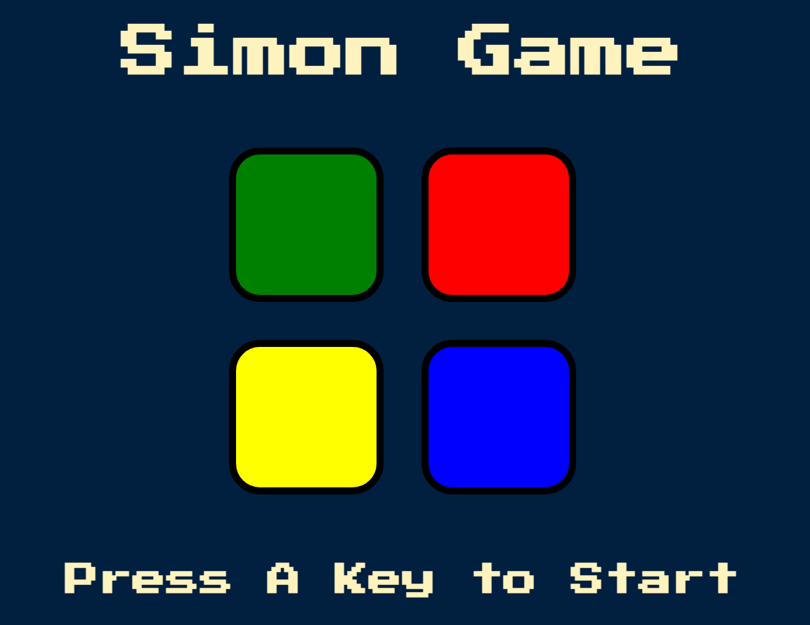
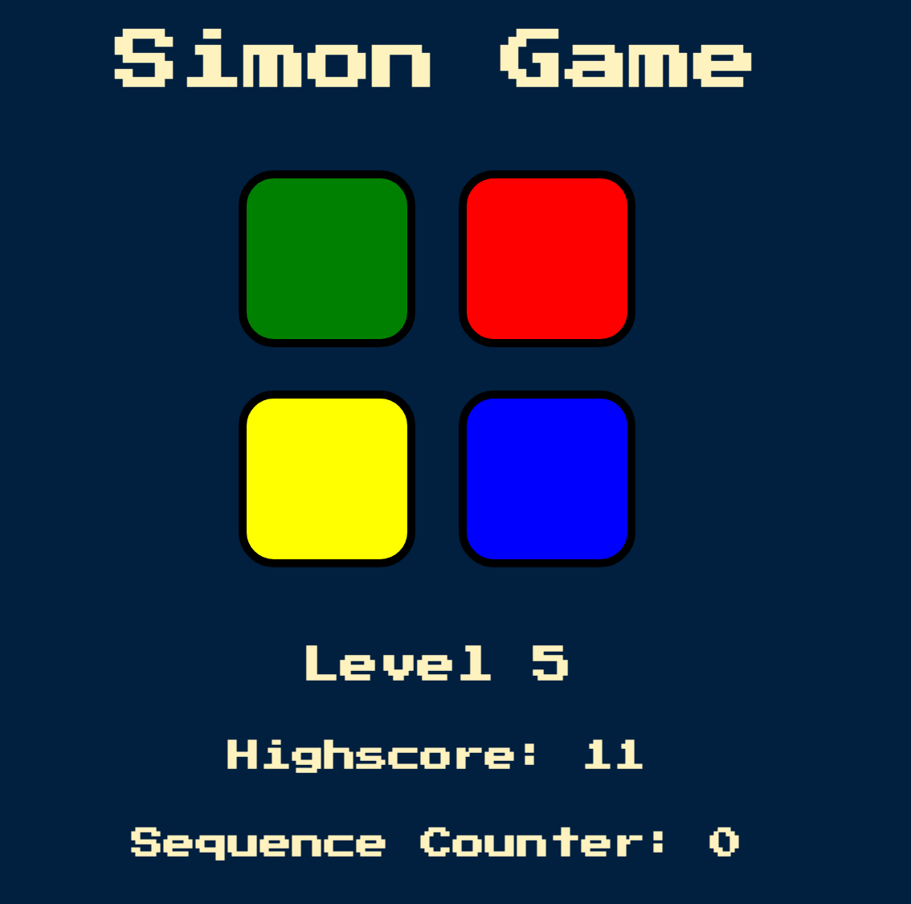

# Simon Game

In this project I practiced JS & JQuery, the css images and the html are
boilerplate from the course's resource with some modifications.

## Usage

* When the page is loaded you can press any key to start the game.
* A quick flash and a sound audio will prompt on a random color button indicating
the button you need to remember.
* Pressing the correct sequence will initiate the next sequence and another
random prompt will occur.
* Pressing the wrong button by not following the sequence is game over stops.
* You can press any key to start over.
* While making progress there is a level indicator, a success counter, and a
highscore which resets on refresh.

Was interesting working with JQuery to manipulate html elements and apply logic
to a website.
First JS focused project :).

